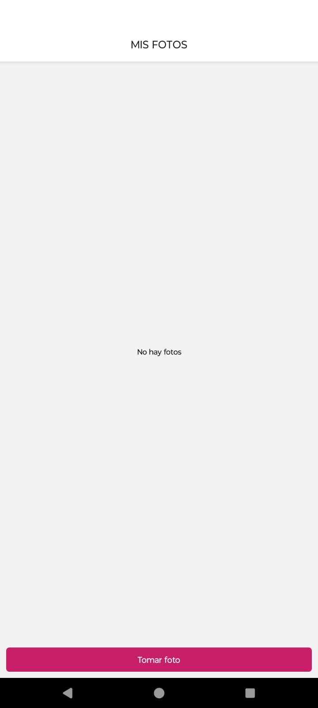
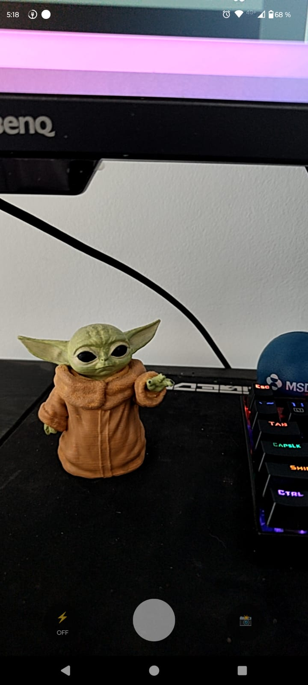
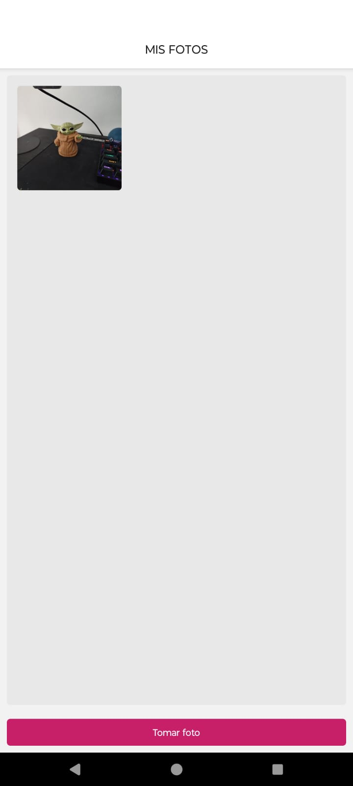
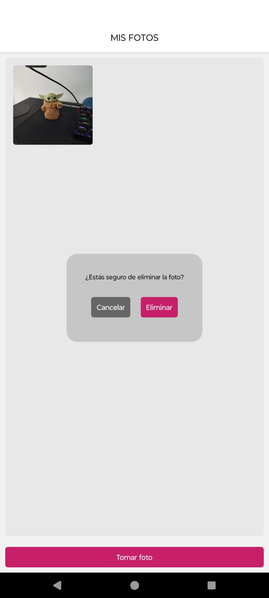
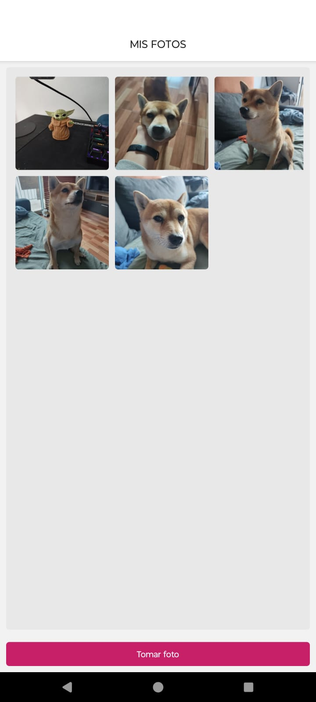
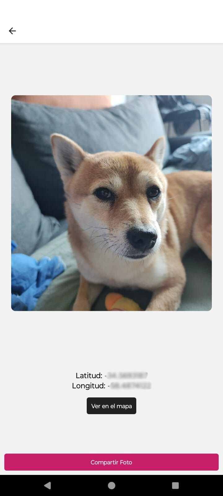
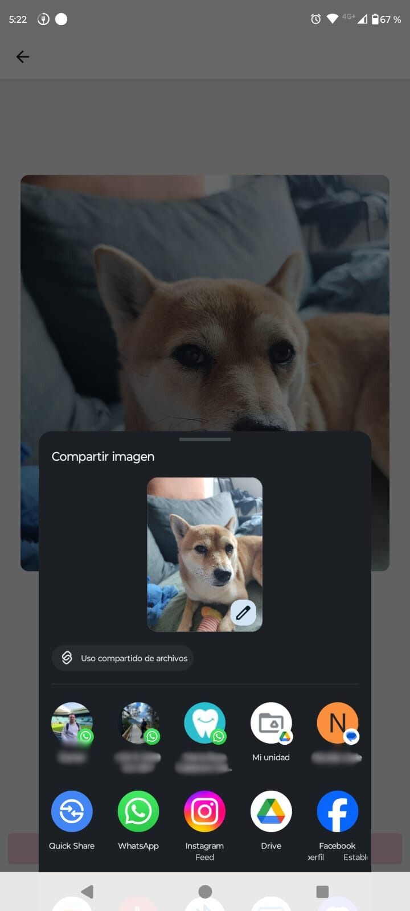

# Welcome 👋

This is a simple app to capture photos. You can:
- Take a photo
- Delete a photo
- Share a photo
- View a photo
- Open location in Maps

## Screenshots
[](./screenshots/home_empty.jpg)
[](./screenshots/capture_screen.jpg)
[](./screenshots/home_with_photo.jpg)
[](./screenshots/home_delete_photo.jpg)
[](./screenshots/home_multiple_photos.jpg)
[](./screenshots/photo_screen.jpg)
[](./screenshots/photo_screen_sharing.jpg)

## Get started

1. Install dependencies

   ```bash
   npm install
   ```

2. Start the app

   ```bash
    npx expo start
   ```

